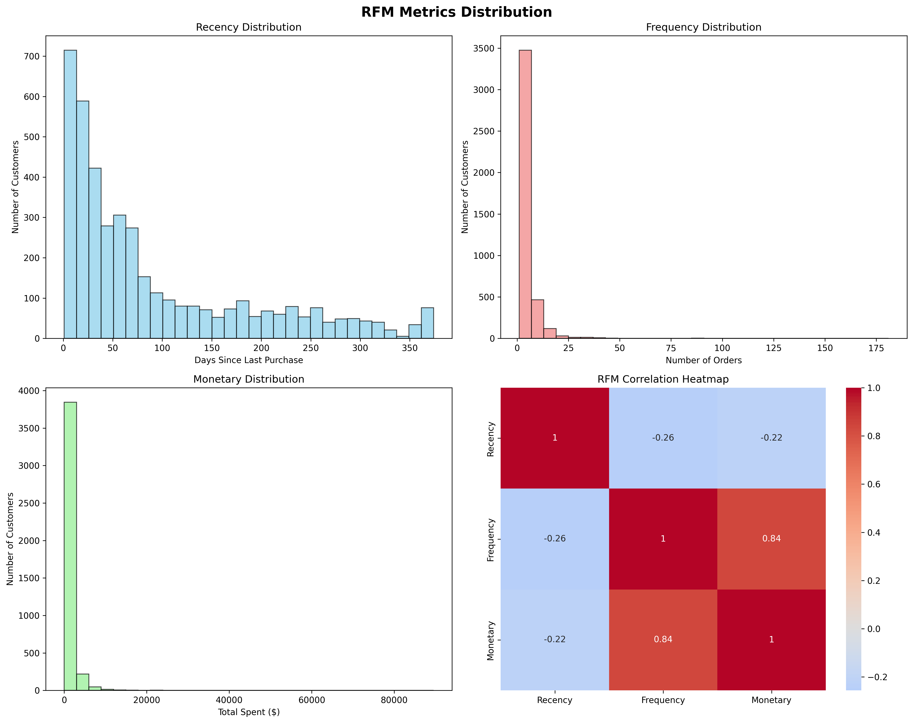
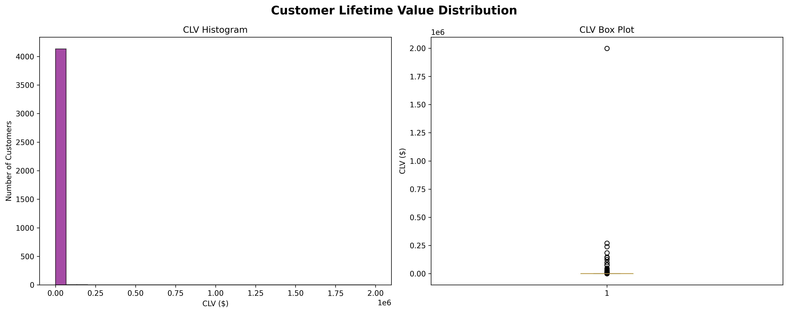
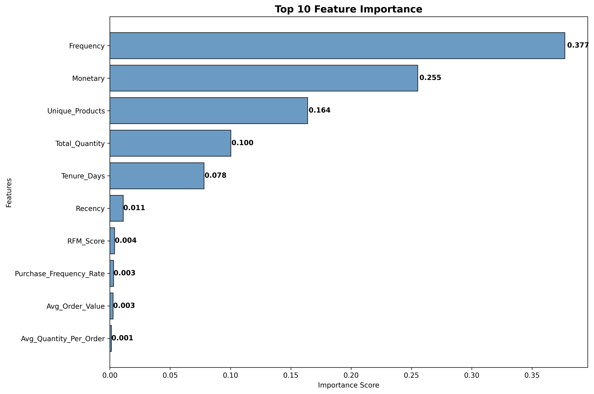
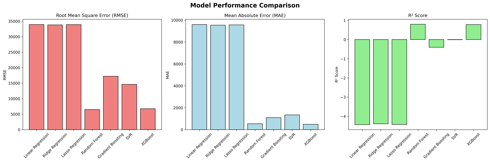
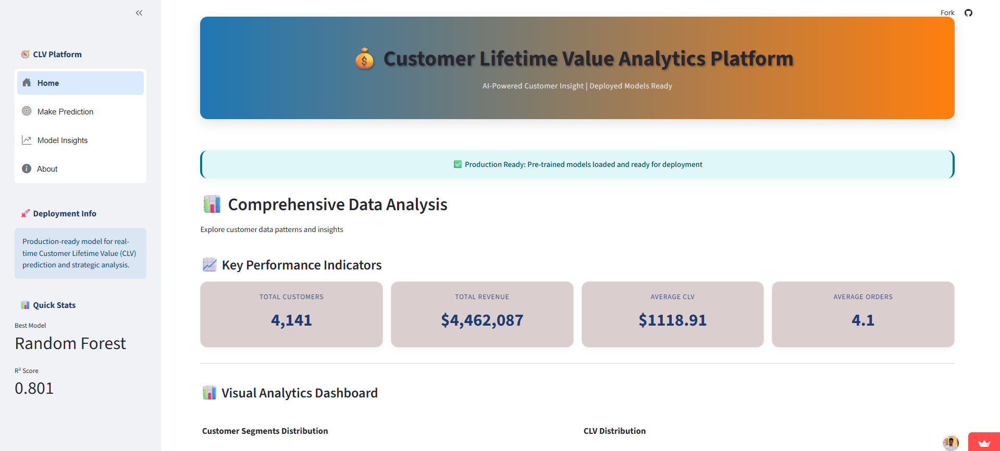
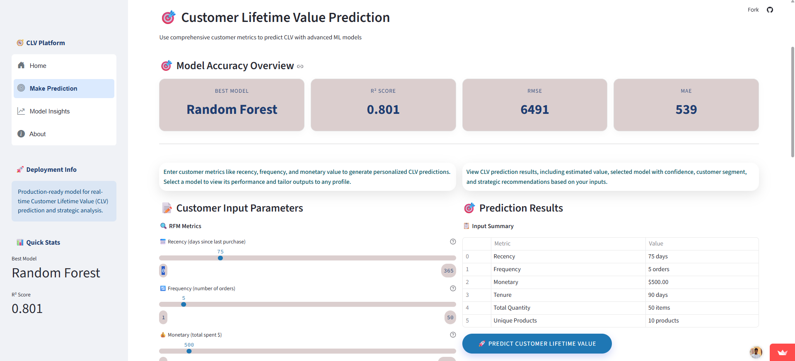
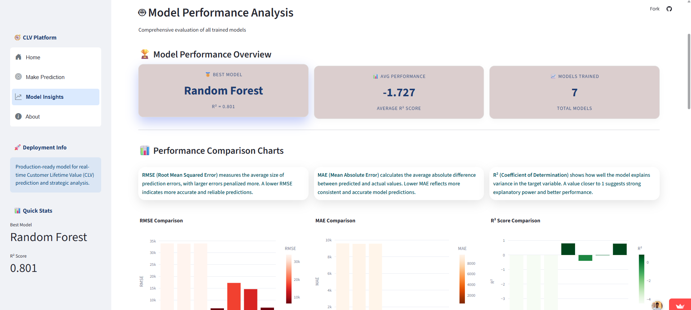
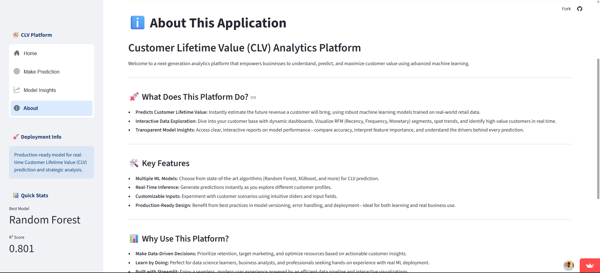
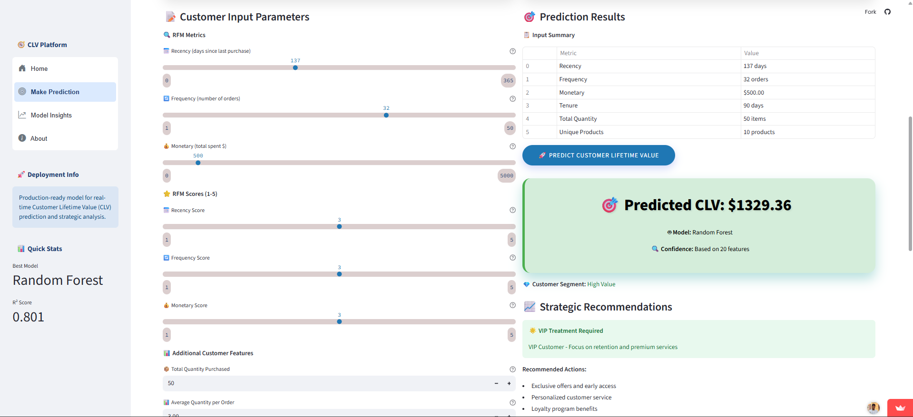
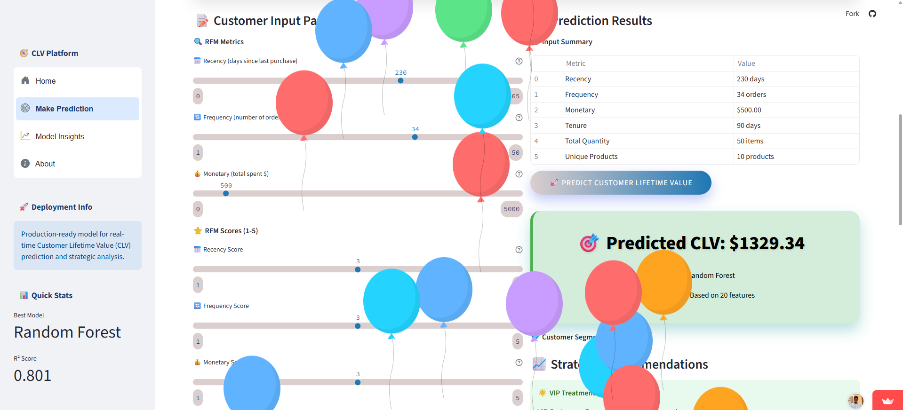

# 💰 Customer Lifetime Value (CLV) Prediction Project

**Live Demo:** [CLV Dashboard App](https://clv-prediction-dashboard.streamlit.app/)


🚀 A complete end-to-end machine learning and dashboarding solution to predict Customer Lifetime Value (CLV) using the Online Retail Dataset. This solution includes automated data cleaning, feature engineering, multi-model training, and a production-ready Streamlit app with rich UI/UX.

---

> 📝 **Note:**  
> This repository is maintained as part of the CSI (Celebal Summer Internship) program and is intended for educational use.

## 📌 Project Objective

**Predict the future monetary value a customer will bring to a business**, using their transaction history, purchase frequency, recency, and additional behavioral metrics. The aim is to help businesses:

- Identify high-value customers 🏆
- Strategize marketing based on customer segments 🎯
- Use real-time dashboards for actionable insights 📊

## 📊 Dataset

The project uses the **Online Retail Dataset** from Kaggle:

- **Source**: [Kaggle - Online Retail Dataset](https://www.kaggle.com/datasets/lakshmi25npathi/online-retail-dataset)
- **Description**: E-commerce transactions from a UK-based retailer
- **Time Period**: December 2009 - December 2011
- **Features**: Invoice, StockCode, Description, Quantity, InvoiceDate, Price, CustomerID, Country

---

## 📁 Project Structure

```
clv-prediction-project/
│
├── .streamlit/
│   └── config.toml                                 # Streamlit UI configuration (layout, theme)
│
├── data/                                           # Raw, cleaned, and transformed data files
│   ├── cleaned_retail_data.csv                     # Preprocessed version of the raw dataset
│   ├── clv_dataset.csv                             # Final dataset used for model training
│   ├── modeling_features.csv                       # Dataset with selected features for modeling
│   ├── online_retail_dataset.csv                   # Original raw retail transaction dataset
│   └── rfm_analysis.csv                            # RFM (Recency, Frequency, Monetary) analysis results
│
├── notebook/
│   └── CLV_Modeling.ipynb                          # Jupyter notebook for EDA, modeling, and evaluation
│
├── outputs/
│   ├── models/                                     # Serialized machine learning models and metadata
│   │   ├── clv_model_gradient_boosting.pkl         # Gradient Boosting model file
│   │   ├── clv_model_lasso_regression.pkl          # Lasso Regression model file
│   │   ├── clv_model_linear_regression.pkl         # Linear Regression model file
│   │   ├── clv_model_random_forest.pkl             # Random Forest model file
│   │   ├── clv_model_ridge_regression.pkl          # Ridge Regression model file
│   │   ├── clv_model_svr.pkl                       # Support Vector Regression model file
│   │   ├── clv_model_xgboost.pkl                   # XGBoost model file
│   │   ├── feature_names.pkl                       # Pickled list of feature names used in training
│   │   └── scaler.pkl                              # Scaler object used for feature normalization
│   │
│   ├── plots/                                      # Generated plots and visual insights
│   │   ├── actual_vs_predicted_random_forest.png   # Plot comparing actual vs predicted values
│   │   ├── clv_dashboard.png                       # Screenshot/visual of Streamlit dashboard
│   │   ├── clv_distribution.png                    # Histogram of predicted CLV values
│   │   ├── customer_segments.png                   # Customer segmentation visualization
│   │   ├── feature_importance.png                  # Feature importance from a model
│   │   ├── model_comparison.png                    # Model comparison based on evaluation metrics
│   │   ├── rfm_distribution.png                    # Distribution plot of RFM values
│   │   └── top_customers.png                       # Visualization of top CLV customers
│   │
│   └── results/
│       ├── feature_importance.csv                  # Tabular data showing feature importance scores
│       └── model_evaluation_results.csv            # Metrics (R2, MAE, RMSE, etc.) for all trained models
│
├── src/                                            # Source code for the pipeline
│   ├── data_cleaning.py                            # Cleans raw retail data (missing values, formatting, etc.)
│   ├── feature_engineering.py                      # Generates RFM features and prepares final dataset
│   ├── modeling.py                                 # Trains multiple regression models and evaluates them
│   └── visualization.py                            # Generates all the charts and plots for analysis
│
├── webAppImg/                                      # Screenshots of the Streamlit web application
│   ├── about.png                                   # About section image
│   ├── CLV_prediction.png                          # Main CLV predicted result
│   ├── home.png                                    # Home page layout
│   ├── sample_prediction.png                       # Page showing predicted result
│   ├── model_insights_page.png                     # Visual of model metrics/insights
│   └── prediction_page.png                         # Page showing prediction interface
│
├── streamlit_app.py                                # Streamlit app file to launch the interactive dashboard
├── run_pipeline.py                                 # Script to run the entire pipeline (cleaning → modeling)
├── requirements.txt                                # Lists Python packages and dependencies required to run the project
└── README.md                                       # Project overview, setup instructions, and usage guide

```

## 🛠️ Installation

1. **Clone the repository:**

```bash
git clone https://github.com/your-username/clv-prediction-project.git
cd clv-prediction-project
```

2. **Create virtual environment:**

```bash
python -m venv venv
source venv/bin/activate  # On Windows: venv\Scripts\activate
```

3. **Install dependencies:**

```bash
pip install -r requirements.txt
```

4. **Use the Streamlit Dashboard**

```bash
streamlit run streamlit_app.py
```

Then open your browser to `http://localhost:8501`

---

## ✨ Features

- 📦 Full data pipeline from raw CSV to production dashboard
- 📈 RFM analysis and customer segmentation
- 🧠 Trains and compares 7 regression models
- 🔍 Feature importance charts and metric tables
- 🎯 Real-time CLV prediction for user-input profiles
- 🧭 Navigation: Home | Make Prediction | Model Insights | About
- 🌐 Mobile-responsive UI using custom CSS and Plotly visuals

---

## 🤖 Models

The project implements multiple regression models for CLV prediction:

| Model | Description | Use Case |
|-------|-------------|----------|
| **Linear Regression** | Simple baseline model | Quick insights |
| **Random Forest** | Ensemble method with feature importance | Best overall performance |
| **XGBoost** | Gradient boosting | High accuracy |
| **Ridge/Lasso** | Regularized linear models | Feature selection |

**Performance Metrics**:

- **R² Score**: Indicates prediction power (closer to 1 is better)
- **MAE**: Measures average error magnitude
- **RMSE**: Penalizes larger errors


## 📈 Results

### Sample Results (will vary based on your data):

- **Best Model**: Random Forest
- **R² Score**: ~0.85
- **RMSE**: ~$50-100
- **Key Features**: Monetary, Frequency, Recency

### Customer Segments

- **Champions**: High value, frequent buyers
- **Loyal Customers**: Regular, valuable customers
- **At Risk**: Previously valuable, now inactive
- **Lost**: Haven't purchased recently

---

## 📊 Visual Insights

Visuals generated from the app to drive insight and exploration:

### RFM Segmentation:


> Shows customer groupings based on Recency, Frequency, and Monetary scores.

### CLV Distribution:


> Histogram illustrating customer value concentration across the base.

### Feature Importance:


> Highlights key drivers affecting CLV predictions.

### Model Comparison:


> Benchmark comparison of all trained models based on R², MAE, RMSE.

---

## 🌐 Dashboard Usage Guide

### 1. **Launch the App**

Run the app with:

```bash
streamlit run streamlit_app.py
```

### 2. **Navigation Tabs**


> **Home**: Summary analytics and charts from historical data
---

> **Make Prediction**: Input customer data and choose model for CLV prediction
---

> **Model Insights**: Compare model performance and see feature influence
---

> **About**: Overview of project goals and limitations

### 3. **Making Predictions**



- Use sliders and inputs to simulate a customer profile (recency, frequency, etc.)
- Choose a model (e.g., Random Forest)
- Click “Predict” to get:
  - Estimated CLV
  - Recommended customer segment (High / Medium / Low)
  - Strategic business actions (e.g., retention, targeting)

### 4. **Customize Dashboard**

The UI is built with custom CSS for an enterprise look. Modify:

- `.streamlit/config.toml` for layout
- `streamlit_app.py` for branding, chart themes

---

## 📊 Sample Predictions



```python
# Example: Predict CLV for a customer
customer_features = {
    'Recency': 230,      # Days since last purchase
    'Frequency':34,     # Number of orders
    'Monetary': 500,    # Total spent
    'R_Score': 3,       # Recency score (1-5)
    'F_Score': 3,       # Frequency score (1-5) 
    'M_Score': 3        # Monetary score (1-5)
}

predicted_clv = model.predict(customer_features)
# Output: $1329.34
```


## 📝 Model Interpretation

### Feature Importance (Random Forest)

1. **Monetary**: Total amount spent (most important)
2. **Frequency**: Number of orders
3. **Recency**: Days since last purchase
4. **Average Order Value**: Spending per transaction
5. **Unique Products**: Product diversity

### Business Insights

- **High CLV Indicators**: Recent purchases, frequent orders, high spending
- **Risk Factors**: Long recency, low frequency, declining monetary value
- **Segmentation**: Clear customer tiers for targeted marketing

## 🤝 Contributing

1. Fork the repository
2. Create a feature branch (`git checkout -b feature/AmazingFeature`)
3. Commit changes (`git commit -m 'Add AmazingFeature'`)
4. Push to branch (`git push origin feature/AmazingFeature`)
5. Open a Pull Request

## 📄 License

This project is licensed under the MIT License - see the [LICENSE](LICENSE) file for details.

## 🙏 Acknowledgments

- **Dataset Source**: [Kaggle Online Retail Dataset](https://www.kaggle.com/datasets/lakshmi25npathi/online-retail-dataset)
- **RFM Analysis**: Based on marketing analytics best practices
- **Machine Learning**: Scikit-learn, XGBoost communities
- **Visualization**: Matplotlib, Seaborn, Plotly libraries

## 📞 Contact

- **Author**: [Shubham Sourav](https://github.com/ShubhamS168)
- **Email**: [shubhamsourav475@gmail.com](mailto:shubhamsourav475@gmail.com)
- **LinkedIn**: [in](https://www.linkedin.com/in/shubham-sourav-460493264/)
- **GitHub**: [ShubhamS168](https://github.com/ShubhamS168)

---

## ✍️ Author

**Shubham Sourav**  
*Data Science Intern at Celebal Technologies*

---

## 📚 Project Goal Reminder

**Customer Lifetime Value Prediction**

The objective of this project is to **predict the future value a customer brings to a business** over the entire duration of their relationship. The system is designed to:

- 🛍️ Leverage **past purchase history, purchase frequency, and customer demographics**
- 📈 Estimate **Customer Lifetime Value (CLV)** using machine learning models
- 🧠 Provide insights that help businesses **optimize marketing strategies and customer retention efforts** 

This project applies data-driven techniques to **identify high-value customers**, guide **resource allocation**, and simulate **real-world business decision-making** based on predictive analytics.

---

Happy predicting! 🎉
⭐ **Star this repository if you found it helpful!** ⭐